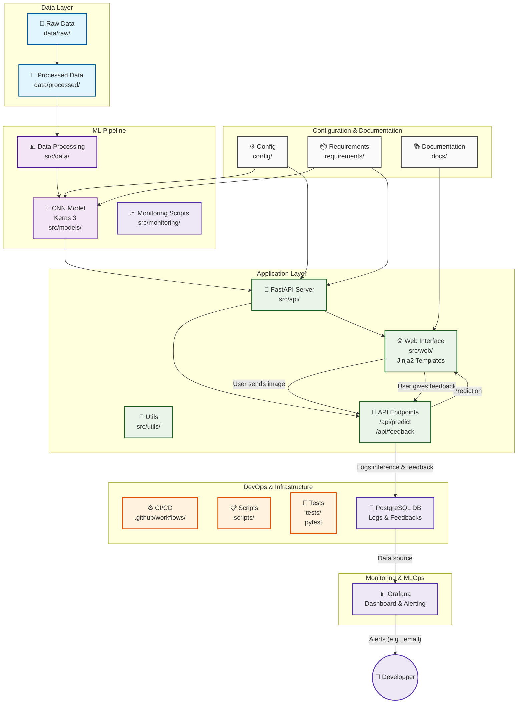

# Computer Vision - Classification d'images Cats & Dogs

[](https://www.python.org)
[](https://fastapi.tiangolo.com/)
[](https://keras.io/)
[](LICENSE)
[](CONTRIBUTING.md)

<div align="center">

<h3>Classification d'images avec Keras et exposition du modèle via Fast API</br></h3>

[Explore the docs](docs/)

</div>

---

## 📌 Introduction

Ce projet est à vocation pédagogique sur des thématiques IA et MLOps. Il permet de réaliser des tâches de Computer Vision et spécifiquement de la classification d'images par la reconnaissance de chats et de chiens.  
Il est composé de :

- Un modèle de computer vision développé avec Keras 3 selon une architecture CNN. Voir le tutoriel Keras ([lien](https://keras.io/examples/vision/image_classification_from_scratch/)).
- Un service API développé avec Fast API, qui permet notamment de réaliser les opérations d'inférence (i.e prédiction), sur la route `/api/predict`.
- Une application web minimaliste (templates Jinja2).
- Des tests automatisés minimalistes (pytest).
- Un pipeline CI/CD minimaliste (Github Action).
- Un système de logging des inférences et de collecte de feedback utilisateur via une base de données PostgreSQL.

## 🏗️ Architecture de l'application



## 📁 Structure du projet

```txt
project-name/
├── .github/
│   ├── workflows/           # CI/CD pipelines
│   └── ISSUE_TEMPLATE/      # Templates d'issues
├── config/                  # Fichiers de configuration
├── data/
│   ├── raw/                 # Données brutes (gitignored)
│   ├── processed/           # Données traitées (gitignored)
│   └── external/            # Données externes/références
├── docker/                  # Dockerfiles et compose
├── docs/                    # Documentation
├── notebooks/               # Jupyter notebooks pour exploration
├── requirements/            # Dépendances par environnement
│   ├── base.txt
│   ├── dev.txt
│   └── prod.txt
├── scripts/                 # Scripts d'automatisation/déploiement
├── src/                     # Code source principal
│   ├── api/                 # APIs et services web
│   ├── data/                # Scripts de traitement des données
│   ├── models/              # Modèles ML/IA
│   ├── monitoring/          # Monitoring des modèles
│   ├── utils/               # Utilitaires partagés
│   └── web/                 # Templates jinja2
├── tests/                   # Tests unitaires et d'intégration
├── .env.example             # Variables d'environnement exemple
├── .gitignore
├── README.md
├── Makefile                 # Commandes fréquentes
└── pyproject.toml           # Configuration Python/packaging
```

## 🛠️ Commandes utiles

*Section minimaliste à faire évoluer.*

```bash
make env           # Installer les dépendances dans un environnement virtuel
```

## 🎯 API

Lorsque l'environnement virtuel est activé, vous pouvez lancer le serveur de l'API ...

```bash
python scripts/run_api.py
```

... et visiter la page de documentation Swagger :


## 📊 Application web

Lorsque l'environnement virtuel est activé, vous pouvez lancer le serveur de l'API ...

```bash
python scripts/run_api.py
```

... et utiliser l'application web :


## Monitoring (Grafana)

Pour visualiser les métriques de l'application en temps réel (temps d'inférence, feedbacks, etc.), un dashboard Grafana est mis à disposition.

### Configuration du Dashboard

La configuration du dashboard est disponible via un fichier JSON, dans `config/Cats and Dogs app Dashboard.json`. Vous pouvez l'importer dans votre instance Grafana pour visualiser les métriques.

### Mise en Place

#### Installation (installation de Grafana en local)

1.  **Installer Grafana** : Suivez les instructions officielles pour votre système d'exploitation.
2.  **Démarrer Grafana** : Lancez le serveur Grafana (il sera accessible sur `http://localhost:3000`, login: `admin`, pass: `admin`).
3.  **Ajouter la source de données** :
    *   Allez dans `Connections` -> `Data sources` -> `Add new data source`.
    *   Choisissez `PostgreSQL`.
    *   Configurez la connexion à votre base de données (même configuration que celles de l'API, que vous avez configuré dans le fichier `.env`).
4.  **Importer le Dashboard** :
    *   Allez dans `Dashboards` -> `New` -> `Import`.
    *   Uploadez le fichier `dashboard.json` fourni dans le projet.
    *   Sélectionnez la source de données PostgreSQL que vous venez de créer.

### Aperçu du Dashboard


## Licence

MIT - voir LICENSE pour plus de détails.
